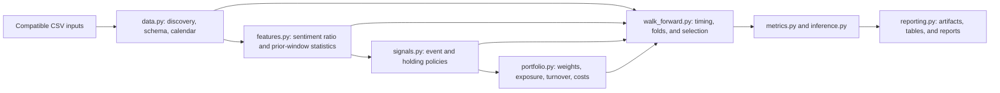

# Architecture

## Design

The project is a small Python package built around pure transformations, explicit dates, frozen
configuration, and I/O at the boundaries. Restricted source data remains external. Features,
signals, portfolio rules, folds, metrics, and reported values are defined in `src/`, not notebooks.

## Modules

- `config.py` defines frozen configuration objects and canonical configuration hashes.
- `source_gate.py` validates source-file identity, the ordered calendar, and exact outer-fold
  boundaries for empirical runs.
- `data.py` handles file discovery, schema validation, adjusted-open construction, panel assembly,
  and the signal/execution/return-date mapping.
- `features.py` reconstructs Bull/Bear measures, rolling statistics, and availability masks.
- `signals.py` defines one-interval events and bounded holding policies.
- `portfolio.py` implements long-only, balanced neutral, and directional portfolios, together with
  exposure, turnover, costs, and benchmark accounting.
- `walk_forward.py` defines deterministic outer blocks and training-only parameter selection.
- `metrics.py` and `inference.py` implement performance, risk, uncertainty, and multiplicity
  calculations.
- `diagnostics.py` and `robustness.py` implement the predefined secondary analyses.
- `legacy.py` contains an isolated clean-room comparison with the original exercise.
- `reporting.py` writes content-addressed local artifacts and reports.
- `cli.py` exposes data inspection, empirical runs, synthetic verification, reporting, and a
  repository-safety scan.

## Data model

Validated inputs form a unique, sorted `(date, ticker)` panel. Every price session is preserved even
when sentiment is unavailable. Feature and signal functions do not read files or global state.
Portfolio returns reconcile to stored weights, asset returns, and transaction costs.

Empirical weights, scores, returns, aggregates, and reports are generated only under the ignored
`reports/artifacts/` directory. Each run records source, configuration, dependency-lock, Git, fold,
and artifact hashes. These records establish computational lineage; they do not establish a right
to redistribute the underlying data or derived results.

The package namespace is `news_sentiment_trading` and the console command is
`news-sentiment-trading`.

## Scope

The implementation uses pandas and NumPy for the panel pipeline, SciPy for statistical routines,
and Matplotlib for figures. A database, workflow engine, feature store, or web service would add
complexity without helping a 602-session, ten-equity study.
